花里胡哨控件集合
===

个人开发的几个比较有意思的控件的集合。

上班摸鱼鼓捣出来的。


## 互动按钮

仓库地址：[InteractiveButtons](https://github.com/iwxyi/Qt-InteractiveButtons)

带有超强交互动画的按钮，可轻松扩展，下面很多控件都是基于它

- 所有颜色自定义
- 鼠标悬浮渐变
- 两种点击效果：鼠标点击渐变 / 水波纹动画（可多层波纹叠加）
- 额外鼠标移入/移出/按下/弹起的实时/延迟共8种事件
- 鼠标悬浮图标位置主动变化
- 鼠标拖动图标抖动反弹效果
- 鼠标进入父控件时开启出现效果，或启动时出现
- 延迟出现的动画效果（多个按钮连续）
- 记录开关状态
- 直接设置边框、圆角显示
- 禁用时半透明+点击穿透效果
- 添加额外的边缘角标
- 三种前景模式：图标、文字、带遮罩的图标（任意变色）
- 支持QSS直接设置部分属性
- 与父类 QPushButton 兼容
- 时间准确性：根据时间戳计算动画进度，即使在低性能机器上也可准时完成动画
- 一按钮多功能，稳定兼容多种情况下焦点事件
- 极其强大的可扩展性，继承该按钮后可任意修改显示效果和动画效果

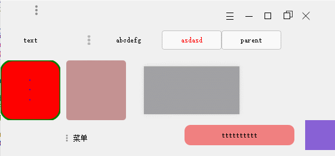


## 菜单

仓库地址：[FacileMenu](https://github.com/iwxyi/Qt-FacileMenu)

非常简单易用、优雅美观的菜单，每一处都带有动画，连分割线都不放过

无限层级，响应键盘、鼠标单独操作，支持单快捷键。

允许添加自定义 action、widget、layout，当做特殊的 QDialog 使用。

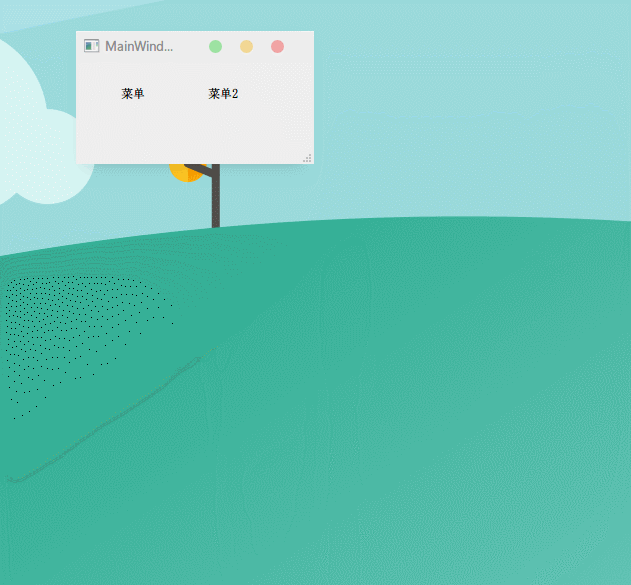

超简单使用方法：

```C++
FacileMenu* menu = new FacileMenu(this);
menu->addAction("开始播放 (&S)", [=]{
    /* 添加动作菜单项 */
})->disable(!playing);
menu->exec();
```


## 趣味开关

仓库地址：[SapidSwitch](https://github.com/iwxyi/Qt-SapidSwitch)

- 全局非线性动画、支持手势拖拽
- 爱心形状的switch开关，支持手势拖动、按压效果
- 线条样式的3种开关


## 轮播图

仓库地址：[SlideShow](https://github.com/iwxyi/Qt-SlideShow)

懒得取名的只为了好看的轮播图。

- 左右轮播（废话）
- 鼠标悬浮切换，无需点击
- 自动定时轮播
- 自动裁剪和缩放不同尺寸图片
- 任意添加、插入、删除
- 单击事件，支持索引和自定义文本
- 界面美观，圆角、阴影、卡片内偏移、非线性并行动画、渐变切换等

在图片切换的同时，每张图片内部还有一丝丝的“**漂移**”效果。除了带来灵活的视觉效果外，还使得左右缩略图露出的部分可以很好的**显示偏向中心的内容**。

另外，在两图交替的那一瞬间，采用了很微妙的**渐变消失**特效，从而**不会产生瞬间变换的闪屏感觉**，这是其它轮播图都未能做到的。


## 果冻滚动条

仓库地址：[SlimScrollBar](https://github.com/iwxyi/Qt-SlimScrollBar)

可以像弓弦一样拉出来，并且来回弹动的普通滚动条。

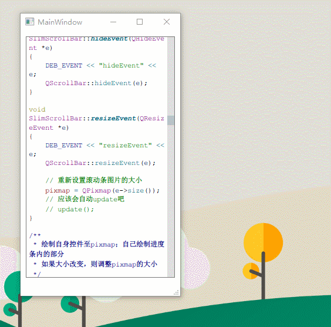

支持设置到任意垂直滚动条上，超简单使用方法：

```C++
widget->setVerticalScrossbar(new SlimScrollBar(widget->parentWidget()));
```


## 会逃跑的按钮

仓库地址：[EscapeDialog](https://github.com/iwxyi/EscapeDialog)

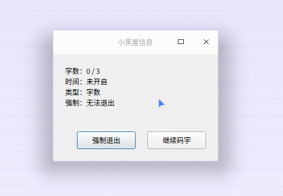


## 按钮三剑客

奶酪被拉出来的粘性效果（但其实更像果冻）

仓库地址：[JellyButtonBox](https://github.com/iwxyi/Qt-JellyButtonBox)

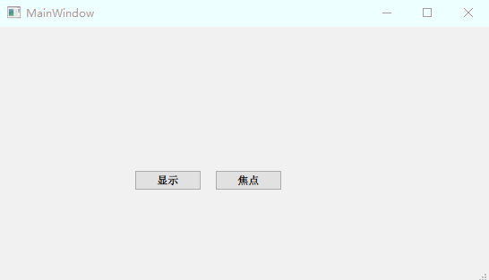


## 标签输入框

仓库地址：[LabeledEdit](https://github.com/iwxyi/Qt-LabeledEdit)

带有标签动画、焦点动画、正确提示、错误警告的单行输入框控件。

- 全局非线性动画
- Label每个字符的动画先后、动画距离都不一样
- 正确动画中，勾原先的弹动横线长度 = 圆弧弧长 = 显示一部分勾的弧长+一部分勾长 = 勾的右线条长
- 错误动画带有延迟，更像波浪从右往左传播
- 字符就算在动画中都可以实时编辑

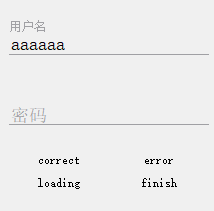

#### 注册动画

当前**写作天下**中的注册动画，使用了本集合中的多种控件：


## 画廊

仓库地址：[GalleryWidget](https://github.com/iwxyi/Qt-GalleryWidget)

- 跟随窗口大小变换位置，并带**移动动画**
- 响应鼠标事件，图片**缩放动画**
- 点击水波纹动画
- 按钮部分引用本人另一个控件：[Qt-InteractiveButton](https://github.com/MRXY001/Qt-InteractiveButtons)


## 可拖拽标签组

仓库地址：[DragableTabWidget](https://github.com/iwxyi/Qt-DragableTabWidget)

模仿VSCode的可任意拖拽的Tab标签组

- 拖拽标签页至新窗口
- 拖拽标签页合并控件
- 无限嵌套的横纵分割布局（类似Qt Creator的编辑框）
- 获取当前使用的标签组、标签页
- 自动向上合并标签组
- 左右拖拽排序

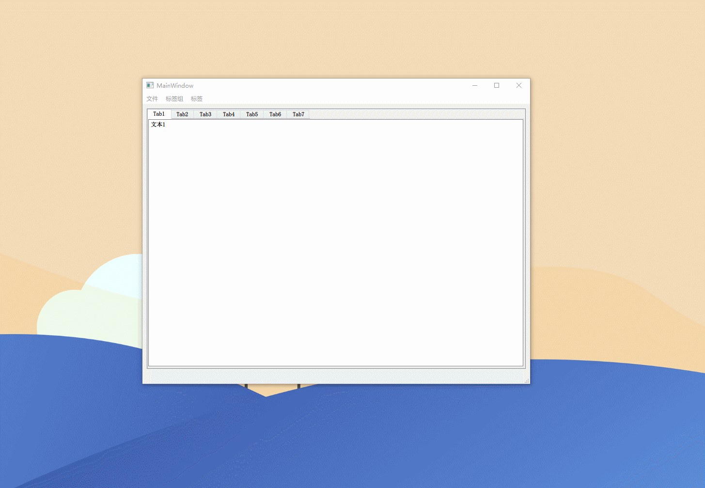


## 可交互验证码

仓库地址：[RandomVerification](https://github.com/iwxyi/Qt-RandomVerification)

- 字符变换动画
- 噪音点、噪音线条动画
- 可拖动字符，验证码跟着变


## 时间轴

仓库地址：[TimelineWidget](https://github.com/iwxyi/Qt-Timeline-Widget)

多列时间轴控件，可与字符串格式自由转换。

- **时间背包**功能：记录所有物品或属性发生的变化，随时回溯
- 时间可输入任意内容，不限于时间
- 每一时间段允许多列，即多个文字节点
- 全自动调整节点大小（宽高），尽量看起来舒服
- 行与行、列与列 之间任意拖拽更换顺序
- 可与文字自由转换，默认一段为一个文字节点
- 方便的多行操作
- 按需修改快捷键
- 所有编辑可撤销
- 美观的调整动画

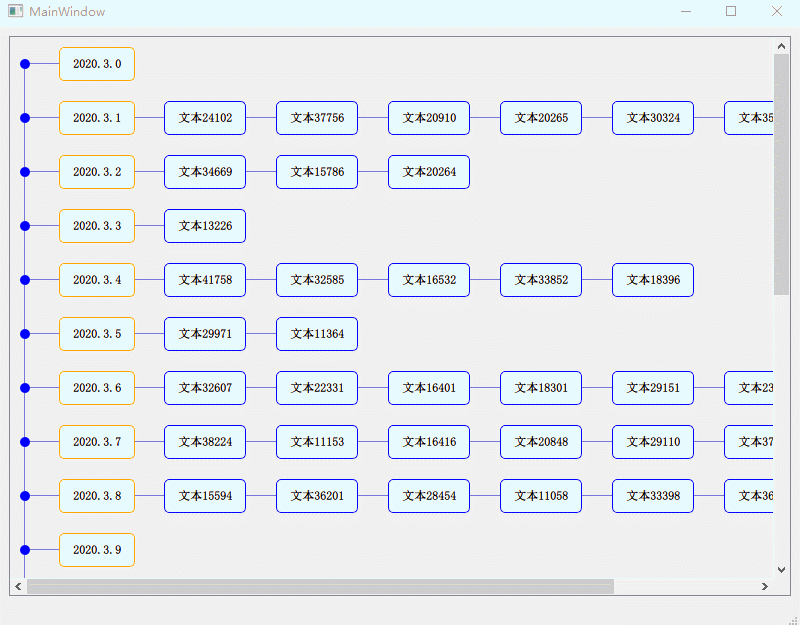


## 指示箭头

仓库地址：[InterestingIndicate](https://github.com/iwxyi/Qt-InterestingIndicate)

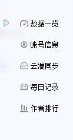


## 贝塞尔波浪

仓库地址：[Bezier-Wave](https://github.com/iwxyi/Bezier-Wave)

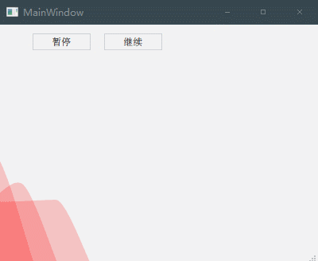


## 微动背景

仓库地址：[Dynamic-Background](https://github.com/iwxyi/Dynamic-Background)

随着时间、空间，色彩以难以察觉的速度缓慢变化。

虽然是动态，但是慢到难以发觉，最适合大段文字的长期阅读与写作。


## 窗口内通知

仓库地址：[Notification-Manager-V2](https://github.com/iwxyi/Qt-Notification-Manager-V2)

仿Windows通知，多个通知显示，定时消失，支持出现/消失动画。

两种使用方式：

- 局部通知，通过信号槽和 Lambda 直接获取通知的操作方式
- 全部通知，触发信号给其他控件使用

另外支持卡片本身、附加三个按钮的点击事件。

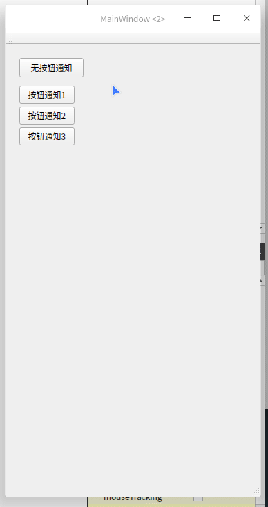

